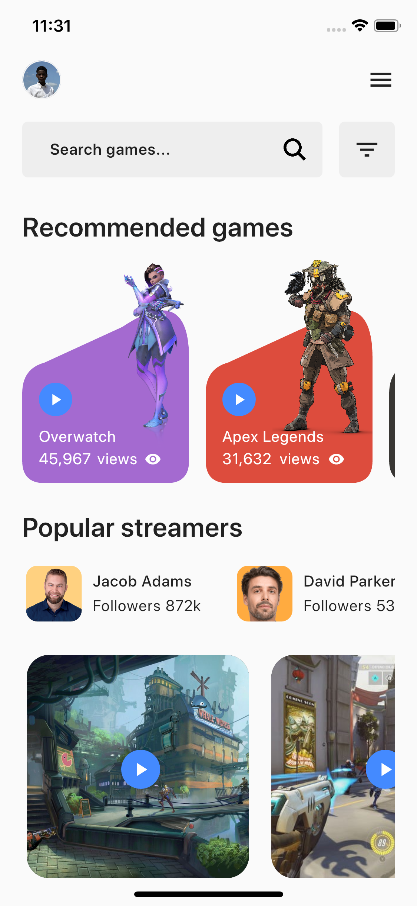
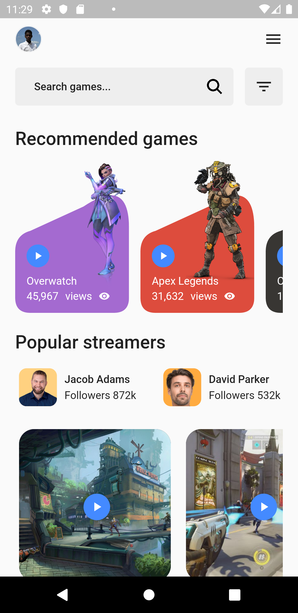
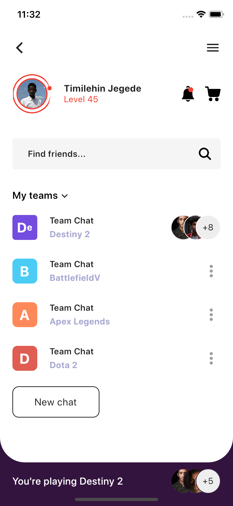
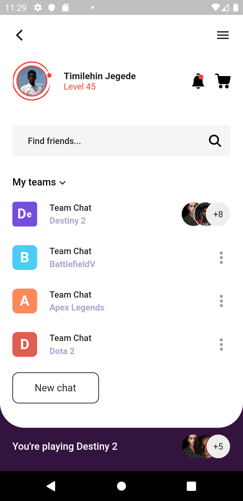

# 😋 Flutter Game Streaming UI 

> **Disclaimer:** I am not in anyway in affiliate with the designer of the screens. I just love the UI and decided to do it in Flutter😽

### Show some :heart: and star the repo to support the project

Don't forget to star⭐ the repo if you like what you see. 😉

   

# 🎥 Demo

# 📸 Screenshots

The screenshots below are taken on a iOS simulator.

| Home Screen                                           | Home Screen                                         |
| ------------------------------------------- | ----------------------------------------- |
|  |  |

The screenshots below are taken on aa android emulator.

| Profile Screen                                         | Profile Screen                                         |
| ----------------------------------------- | ----------------------------------------- |
|  |  |

# ✨ Requirements

- Any Operating System (ie. MacOS X, Linux, Windows)
- Any IDE with Flutter SDK installed (ie. IntelliJ, Android Studio, VSCode etc)
- A little knowledge of Dart and Flutter
- Some fingers to code 😂
- A brain to think 🤓

# Getting Started

This project is a starting point for a Flutter application.

A few resources to get you started if this is your first Flutter project:

- [Lab: Write your first Flutter app](https://flutter.io/docs/get-started/codelab)
- [Cookbook: Useful Flutter samples](https://flutter.io/docs/cookbook)

For help getting started with Flutter, view our
[online documentation](https://flutter.io/docs), which offers tutorials,
samples, guidance on mobile development, and a full API reference.

## Contributors
[Timilehin Jegede](https://github.com/timilehinjegede)

## Reach me

